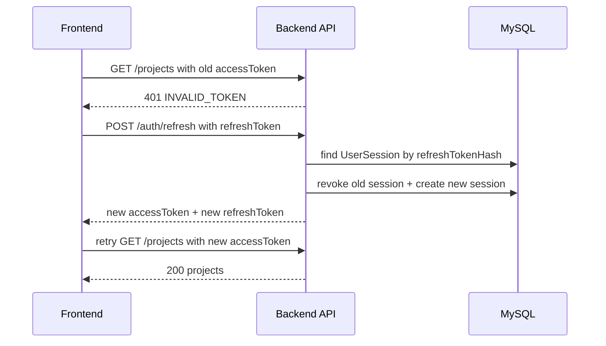

# 前后端鉴权 Refresh Flow 复盘

## 登录成功后发生了什么？

用户登录成功后，后端会返回：

```text
user + accessToken + refreshToken
```

前端会把 `accessToken` 和 `refreshToken` 写入 `localStorage`。

`accessToken` 后续用来访问业务 API，比如 `/projects`、`/todos`。

`refreshToken` 不直接访问业务 API，它只在 `accessToken` 失效后，用来请求 `/auth/refresh`。

## 业务 API 请求时发生了什么？

业务 API 请求会通过 `authenticatedFetch` 发送。

它会先读取本地保存的 `accessToken`，然后自动加到请求头里：

```text
Authorization: Bearer <accessToken>
```

所以页面组件不需要到处自己处理 token，只要调用 API 层函数即可。

## accessToken 过期后发生了什么？

如果业务 API 返回 `401`，说明当前 `accessToken` 没有通过后端鉴权。

这时 `authenticatedFetch` 会读取本地的 `refreshToken`，然后请求：

```text
POST /auth/refresh
```

如果 refresh 成功，后端会返回新的 `accessToken` 和新的 `refreshToken`。前端保存这两个新 token 后，会用新的 `accessToken` 重试刚才失败的业务请求。

如果 refresh 失败，说明登录态已经无法恢复，前端会清理本地 token，让用户重新登录。

## refresh token rotation 为什么要求前端保存新的 refreshToken？

因为后端现在启用了 refresh token rotation。

这意味着每次 refresh 成功后：

```text
旧 refreshToken 对应的 session 会被 revoked
后端会创建新的 session
前端会收到新的 refreshToken
```

如果前端不保存新的 `refreshToken`，下一次 refresh 时还会拿旧 token 去请求。旧 token 已经被撤销，所以后端会返回 `401 INVALID_REFRESH_TOKEN`，用户就会登录失效。

## authenticatedFetch 和 axios interceptor 有什么像？

`authenticatedFetch` 很像 axios interceptor。

它像 request interceptor 的地方是：

```text
请求发出去之前，自动加 Authorization header
```

它像 response interceptor 的地方是：

```text
响应返回 401 后，自动调用 refresh 接口，然后重试原请求
```

区别是 axios interceptor 是框架提供的拦截机制，而 `authenticatedFetch` 是我们自己封装的一层 fetch helper。

## 为什么只能重试一次？

因为第一次请求失败后，前端已经尝试过 refresh。

如果 refresh 后重试仍然失败，说明问题可能不是简单的 `accessToken` 过期，例如：

```text
refreshToken 也失效了
用户已经被删除
后端鉴权配置发生变化
新的 accessToken 仍然无效
```

这时继续无限重试只会造成死循环，所以只能重试一次。

## 请求链路图


