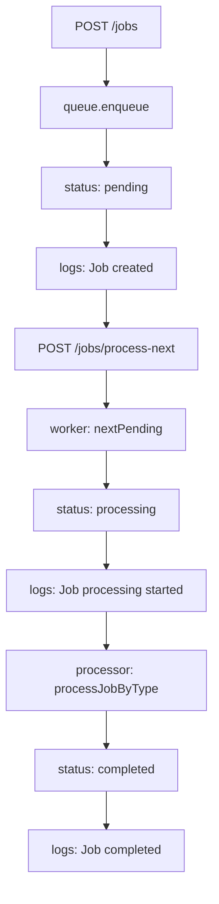

# 后台任务阶段复盘：queue / worker / processor / logs

## 1. queue 负责什么

queue 负责保存任务、查找任务、更新任务状态、记录任务日志。

在现在这个学习项目里，queue 是一个内存数据容器。它内部保存 `jobs` 数组，并提供这些方法：

```text
enqueue
list
nextPending
updateStatus
incrementAttempts
addLog
```

queue 不应该负责真正处理业务。比如它不应该知道怎么发邮件，也不应该知道怎么生成报表。

如果把业务逻辑写进 queue，queue 就会从“数据容器”变成“什么都管的对象”。后面如果换成数据库队列、Redis 队列或 BullMQ，就会很难替换。

## 2. worker 负责什么

worker 负责处理一个 pending job 的状态流转。

它会做这些事情：

```text
从 queue 取出 pending job
把状态改成 processing
记录 Job processing started
调用 processor
成功时改成 completed
失败时记录失败日志并增加 attempts
根据 attempts / maxAttempts 决定 pending 还是 failed
```

worker 不应该负责具体业务。比如它不应该直接写“发邮件逻辑”或“生成报表逻辑”。

如果 worker 里写太多业务逻辑，后面任务类型一多，worker 会越来越复杂。worker 应该更像一个调度器，控制任务生命周期，而不是处理每一种业务。

## 3. processor 负责什么

processor 负责真正执行任务对应的业务逻辑。

比如：

```text
send-email -> 发邮件
generate-report -> 生成报表
unknown-job -> throw error
```

这里我之前理解错了一点：processor 不负责控制 job 的状态流转。状态从 pending 到 processing、completed、failed，是 worker 管的。

processor 只需要表达业务结果：

```text
处理成功 -> 正常 return
处理失败 -> throw error
```

worker 会根据 processor 的结果决定后面的状态。

这样拆开之后，processor 可以专心写业务，worker 可以专心控制流程，职责会更清楚。

## 4. logs 负责什么

logs 负责记录任务处理过程中的关键事件。

`status` 只能表示当前状态，例如：

```text
pending
processing
completed
failed
```

但 `logs` 可以记录过程，例如：

```text
Job created
Job processing started
Job completed
Job processing failed
```

也就是说：

```text
status 说明任务现在是什么状态
logs 说明任务经历了什么过程
```

如果只看 status，排查问题时信息会不够。比如一个任务是 failed，只看 status 不知道它什么时候失败、失败前是否开始处理、是否重试过。

## 成功流程



用文字描述就是：

```text
POST /jobs
-> queue.enqueue
-> job.status = pending
-> logs 记录 Job created
-> POST /jobs/process-next
-> worker 取出 pending job
-> job.status = processing
-> logs 记录 Job processing started
-> processor 按 type 处理
-> processor 成功 return
-> worker 把 job.status 改成 completed
-> logs 记录 Job completed
```

## 失败重试流程

```text
POST /jobs/process-next
-> worker 取出 pending job
-> status 改成 processing
-> addLog("Job processing started")
-> processor throw
-> worker catch error
-> addLog("Job processing failed")
-> incrementAttempts
-> 如果 attempts < maxAttempts，status 回到 pending
-> 如果 attempts >= maxAttempts，status 变 failed
```

processor throw 后，API 仍然可以返回 200，是因为这个错误被 worker 捕获了。

这个错误不是 HTTP 接口崩溃，而是“任务处理失败”。所以 API 可以正常返回处理后的 job 状态，比如 pending 或 failed。

第一次失败不一定等于最终 failed，因为任务可能还有重试机会。

例如默认 `maxAttempts` 是 3，第一次失败后：

```text
attempts = 1
maxAttempts = 3
```

这时任务还可以继续重试，所以状态会回到 pending。

`maxAttempts: 1` 的测试可以直接验证 failed，是因为第一次失败后：

```text
attempts = 1
maxAttempts = 1
```

这已经达到最大尝试次数，所以 worker 会把任务标记成 failed。

## 5. 为什么 jobs API 测试要注入独立 queue

jobs API 测试要注入独立 queue，是为了避免测试之间互相影响。

如果所有测试都使用全局内存队列，那么前一个测试创建的 job 会留在内存里。

这样后面的测试可能会遇到这些问题：

```text
本来以为队列是空的，结果里面还有旧任务
本来想处理刚创建的任务，结果 worker 先处理了前一个测试留下的 pending job
测试顺序一变，结果也变
```

`createJobsTestApp` 每次创建新的 queue，可以让每个测试都从空队列开始。

这和数据库测试隔离很像。数据库测试里也要保证每个测试的数据互不影响，常见做法包括：

```text
每个测试前清空表
每个测试使用事务并回滚
每个测试创建独立测试数据
```

本质都是一句话：

```text
测试应该只依赖自己准备的数据，不依赖其他测试留下的数据。
```

## 6. 我现在真正理解的 3 个点

1. queue、worker、processor 不应该混在一起。queue 保存任务，worker 控制状态，processor 处理业务。
2. processor 抛错不一定代表 API 报错，因为 worker 可以捕获错误并把它转成任务状态变化。
3. 后端测试里只要有内存、数据库、缓存、队列这类有状态的东西，就要考虑测试隔离。
