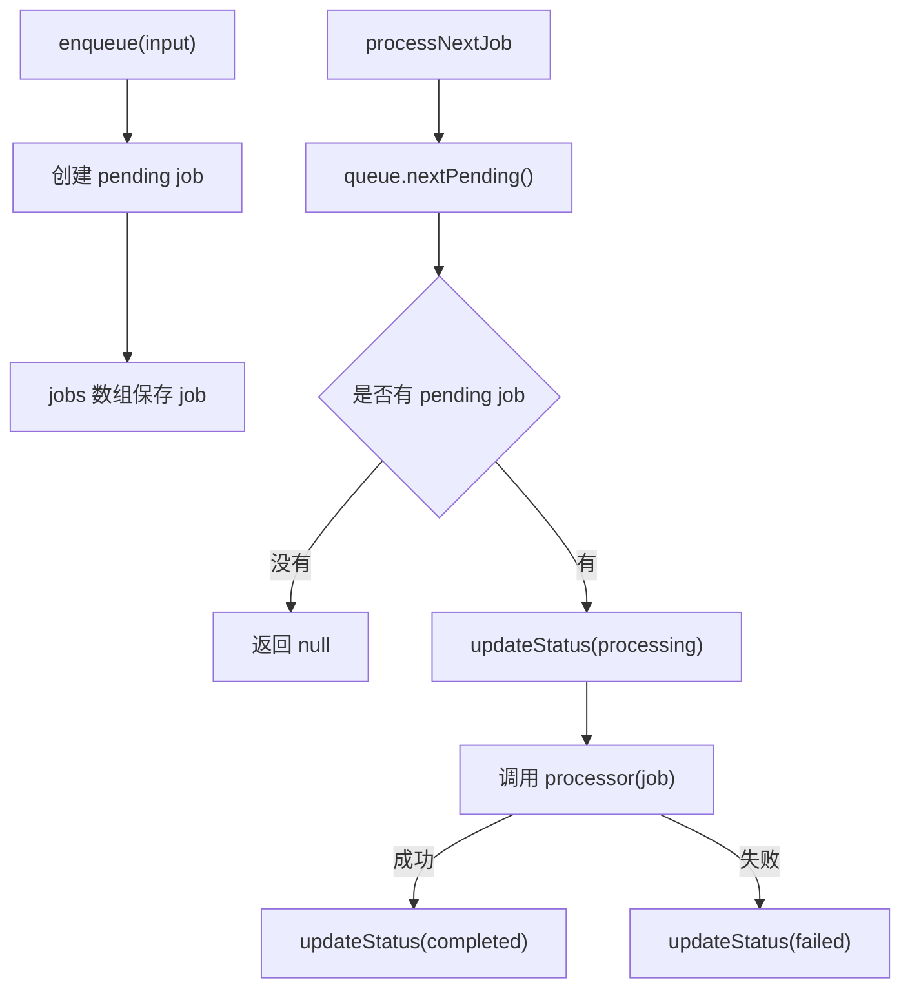

# 后台任务阶段复盘

## 1. 什么是后台任务

后台任务是指不需要在 HTTP 请求里立刻完成的任务。

比如：

- 发邮件
- 生成报表
- 批量导入
- 图片处理
- 定时任务
- 调用比较慢的第三方接口

这些事情如果直接放在 HTTP 请求里同步处理，会让用户一直等响应。更好的方式是：

```text
HTTP 请求只负责提交任务
后台 worker 慢慢处理任务
```

这样接口可以更快返回，慢任务也可以独立重试、记录状态。

## 2. queue / worker / processor 分别负责什么

这里你原来的理解接近了，但需要更准确一点。

queue 不是“创建任务”本身，而是：

```text
queue 负责保存任务、查找任务、更新任务状态。
```

在这个项目里，`createMemoryJobQueue()` 返回的对象就是 queue。

worker 不是“开启任务”，而是：

```text
worker 负责从 queue 里拿一个 pending job，并控制它的状态流转。
```

在这个项目里，`processNextJob()` 就是一个最小版 worker。

processor 不是“调用任务”，而是：

```text
processor 负责真正执行某个 job 的业务逻辑。
```

比如发邮件时，processor 里面才会真正调用邮件服务。

所以三者分工是：

```text
queue：存任务
worker：取任务并管理状态
processor：执行任务的具体业务逻辑
```

## 3. Job 为什么需要 status

Job 需要 status，是因为后台任务不是一瞬间完成的。

一个 job 可能处在不同阶段：

- `pending`：刚进入队列，还没开始处理
- `processing`：worker 已经拿到它，正在处理
- `completed`：processor 正常执行完，任务成功
- `failed`：processor 抛错，任务失败

有了 status，我们才能知道：

```text
哪些任务还没处理
哪些任务正在处理
哪些任务已经成功
哪些任务失败了，后面可能需要重试
```

## 4. enqueue 做了什么

`enqueue` 的作用是把外部传进来的任务信息，包装成一个真正可以被 queue 管理的 Job。

外部传进来的 input 只有：

```ts
{
  type: "send-email",
  payload: {
    to: "user@example.com"
  }
}
```

但真正保存进 queue 的 Job 需要更多字段：

```ts
{
  id: "唯一任务 id",
  type: "send-email",
  payload: {
    to: "user@example.com"
  },
  status: "pending",
  createdAt: "创建时间",
  updatedAt: "更新时间"
}
```

所以：

```text
input 是用户提交的任务信息。
Job 是 queue 真正保存和管理的任务对象。
```

## 5. nextPending 做了什么

`nextPending` 会从队列里找到第一个 `status === "pending"` 的任务。

它只找 pending，是因为 worker 应该只处理还没开始处理的任务。

如果一个任务已经是：

- `processing`：说明它已经被某个 worker 拿走了
- `completed`：说明它已经成功了
- `failed`：说明它已经失败了，后面是否重试要由重试逻辑决定

这些状态都不应该被普通的 `nextPending` 再拿去处理。

所以 `nextPending` 的含义是：

```text
给 worker 找下一个还没处理过的任务。
```

## 6. processNextJob 的流程是什么

`processNextJob` 是一个最小版 worker。

它的流程是：

1. 调用 `queue.nextPending()` 找第一个 pending job。
2. 如果没有 pending job，返回 `null`。
3. 如果找到了，把 job 状态改成 `processing`。
4. 调用 `processor(job)` 执行真正任务逻辑。
5. 如果 processor 正常结束，把 job 状态改成 `completed`。
6. 如果 processor 抛错，把 job 状态改成 `failed`。

状态流转是：

```text
pending -> processing -> completed
pending -> processing -> failed
```

## 7. processor 抛错为什么要标记 failed

processor 抛错说明任务没有成功完成。

如果这时假装成功，把 job 标记成 `completed`，系统就会误以为任务已经处理完了。

比如发邮件失败了，但我们标记成 completed，那么用户可能永远收不到邮件，而系统也不会知道这件事失败过。

所以失败时要标记 `failed`，这样后面可以：

- 在后台管理里看到失败任务
- 记录失败原因
- 做重试机制
- 做告警或人工处理

## 8. 这一阶段我还没完全理解的点

目前已经理解：

- queue 负责保存任务
- worker 负责拿任务并推进状态
- processor 负责执行真正业务逻辑
- pending 是等待处理
- processing 是正在处理
- completed 是成功
- failed 是失败

后面还需要继续理解：

- failed job 要不要重试
- retry count 应该放在哪里
- 真实项目里 queue 为什么通常不用内存，而是用 Redis / BullMQ
- 多个 worker 同时处理时，怎么避免同一个任务被重复处理

## 9. 流程图



## 10. 自测问题

1. 为什么 `list()` 要返回数组拷贝，而不是直接返回内部 `jobs`？

因为如果直接返回内部数组，外部代码就可以绕过 `enqueue`，直接 `push` 或 `pop` 修改队列。返回数组拷贝可以让外部查看任务列表，但不能直接破坏 queue 内部状态。

2. 为什么 `processNextJob` 没有 pending job 时返回 `null`，而不是抛错？

因为队列里暂时没有任务是正常情况，不是系统异常。返回 `null` 表示 worker 当前没拿到任务，调用方可以稍后再试。

3. 为什么 processor 失败时要把 job 标记为 `failed`？

因为 processor 失败说明任务没有成功完成。标记为 `failed` 后，系统后面才能查到失败任务，并基于这个状态做重试、告警或人工处理。
