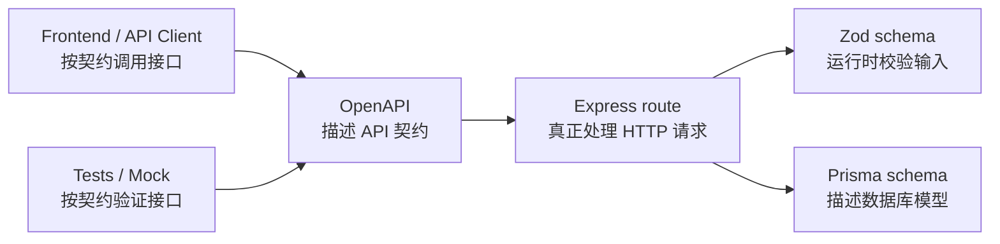

# OpenAPI 契约复盘

## OpenAPI 是什么？

OpenAPI 是 REST API 的契约文档。

它用 JSON 或 YAML 把接口说明清楚，比如：

- 有哪些路径：`/auth/login`、`/projects`
- 每个路径支持什么方法：`GET`、`POST`、`PATCH`、`DELETE`
- 请求 body 需要哪些字段
- query 参数有哪些
- 成功响应长什么样
- 错误响应长什么样
- 哪些接口需要 Bearer Token 鉴权

换句话说，OpenAPI 不是给后端自己“看着舒服”的文档，而是给所有调用 API 的人和工具看的契约。

一个接口只写在 Express route 里时，前端只能通过读代码、问后端、看测试来猜接口长什么样。
有了 OpenAPI 后，接口的输入、输出、状态码、鉴权方式都可以被明确描述。

## OpenAPI 不是什么？

### 它不是 Express route

Express route 是真正处理 HTTP 请求的代码。

比如：

```text
POST /auth/login
```

在 Express 里会执行登录逻辑：

- 读取 `request.body`
- 校验 email / password
- 调用 service
- 返回 accessToken / refreshToken

OpenAPI 不负责执行这些逻辑。

OpenAPI 只负责描述：

```text
这个接口需要什么请求，成功或失败会返回什么响应。
```

所以：

```text
Express route = 执行者
OpenAPI = 说明书 / 契约
```

### 它不是 Zod schema

Zod schema 是运行时校验工具。

比如 `loginUserSchema` 会在请求真正进入业务逻辑前校验：

- `email` 必须是合法邮箱
- `password` 必须是非空字符串

Zod 更靠近“后端运行时安全”。

OpenAPI 更靠近“API 对外描述”。

它们有重叠，因为它们都会描述字段类型和字段规则。
也正因为有重叠，后面才可以用 Zod 辅助生成 OpenAPI，减少手写重复。

### 它不是 Prisma schema

Prisma schema 描述数据库模型。

比如：

```text
User
Project
Todo
UserSession
```

Prisma 关心的是：

- 数据库有哪些表
- 表里有哪些字段
- 表和表之间有什么关系
- TypeScript 代码如何查询数据库

OpenAPI 关心的是接口对外暴露什么。

这两个东西不能直接画等号，因为数据库字段不一定等于 API 字段。
比如：

- 用户登录返回 `accessToken` / `refreshToken`，但这不是数据库里的普通业务表字段
- `passwordHash` 存在数据库里，但绝对不应该出现在 OpenAPI 的响应 schema 里
- `userId` 有些时候来自 token，而不是来自请求 body

所以：

```text
Prisma schema = 数据库结构
OpenAPI = API 输入输出契约
```

## 它能帮前端做什么？

OpenAPI 对前端最大的价值是减少猜测。

前端可以从 OpenAPI 知道：

- 调哪个接口
- 用什么 HTTP method
- 请求 body 应该怎么传
- 哪些接口需要带 token
- 成功时拿到什么字段
- 失败时错误格式是什么

更进一步，OpenAPI 还可以用工具生成：

- Swagger UI：可视化接口文档
- TypeScript 类型：让前端知道响应字段类型
- API client：减少手写 `fetch` / `axios` 调用代码
- Mock server：后端还没写完时，前端先按契约开发

对你现在的 Vue 前端来说，OpenAPI 后面可以帮助 `apps/web` 更稳定地调用 `apps/api`。
尤其是接口多起来后，靠人脑记字段名会很累，靠契约和类型会更稳。

## 它能帮测试做什么？

OpenAPI 可以让测试从“只测业务行为”扩展到“验证接口契约”。

比如测试可以检查：

- `POST /auth/login` 成功响应是否真的包含 `accessToken` 和 `refreshToken`
- 未登录访问 `GET /projects` 是否返回统一错误结构
- 响应里的字段类型是否和文档一致
- 状态码是否符合约定

这类测试叫契约测试。

它不是替代单元测试或集成测试，而是补充一层：

```text
代码真实返回的 API，是否还符合公开文档。
```

如果后端某次改动把响应字段从 `refreshToken` 改成 `token`，业务代码可能还能跑，但前端会断。
契约测试可以更早发现这种破坏。

## 当前 docs/openapi.json 描述了哪些接口？

当前 `docs/openapi.json` 已经描述了三个入门接口：

```text
GET /health
POST /auth/login
GET /projects
```

其中：

`GET /health` 描述了健康检查接口，主要用来确认 API 服务是否可用。

`POST /auth/login` 描述了登录接口：

- 请求 body 需要 `email`
- 请求 body 需要 `password`
- 登录失败时返回 `ErrorResponse`

`GET /projects` 描述了项目列表接口：

- 需要 Bearer Token
- 成功时返回当前用户的 project 列表
- 未登录时返回 `ErrorResponse`

当前文档还没有把所有接口写全，也没有把所有成功响应 schema 都补完整。
这是正常的，因为这一阶段的目标不是一次性写完文档，而是先理解 OpenAPI 的结构。

## 项目里的例子

`POST /auth/login` 在 OpenAPI 里描述了：

- 请求 body 需要 `email` 和 `password`
- 成功后应该返回登录结果
- 登录结果里包含 `user`、`accessToken`、`refreshToken`
- 失败时返回统一的 `ErrorResponse`

这和后端代码里的 `loginUserSchema` 有明显重复：

```text
Zod 里写了一次 email / password 校验。
OpenAPI 里又写了一次 email / password 字段说明。
```

这就是后面学习“用 Zod 辅助生成 OpenAPI”的原因。

`GET /projects` 在 OpenAPI 里描述了：

- 这个接口需要 Bearer Token
- token 来自登录后拿到的 `accessToken`
- 后端会根据 token 判断当前用户是谁
- 返回的 project 列表只属于当前用户

这和前端的 `authenticatedFetch` 也能对应起来：

```text
OpenAPI 说这个接口需要 bearerAuth。
前端请求时就应该自动带 Authorization: Bearer <accessToken>。
```

## 为什么后面可以用 Zod 辅助生成 OpenAPI？

因为 Zod 和 OpenAPI 有一部分信息是重复的。

比如登录请求：

```text
email: string + email format
password: string
```

这件事现在可能会出现两份：

- `loginUserSchema` 里写一份，用于运行时校验
- `docs/openapi.json` 里写一份，用于接口文档

重复的坏处是：

- 容易忘记同步
- 字段规则可能不一致
- 接口越多，维护成本越高

如果用 Zod 辅助生成 OpenAPI，理想状态是：

```text
先维护 Zod schema。
再从 Zod schema 转出一部分 OpenAPI schema。
```

这样 Zod 继续负责运行时校验，OpenAPI 继续负责 API 契约描述，但两者可以共享一部分字段定义。

不过也要注意：

```text
Zod 不能生成所有 OpenAPI 信息。
```

例如这些内容仍然需要额外描述：

- 接口路径
- HTTP method
- 状态码
- 接口 summary
- 是否需要鉴权
- 某些业务错误码

所以更准确的理解是：

```text
Zod 可以帮助生成 OpenAPI 的 schema 部分，但不能完全替代 OpenAPI。
```

## 边界图



这张图可以这样读：

- Express route 是请求真正进入后端后的执行入口
- Zod schema 是请求进入业务逻辑前的输入校验
- Prisma schema 是数据库结构和查询模型
- OpenAPI 是对外暴露的接口契约
- 前端、测试和 Mock 工具都可以围绕 OpenAPI 工作

## 当前理解总结

现在可以先记住这个版本：

```text
OpenAPI 是 API 的机器可读说明书。
它描述接口怎么调用，不执行接口逻辑。
它和 Zod、Prisma、Express 有交集，但职责不同。
```

后面继续深入时，重点不是背 OpenAPI 的所有字段，而是理解它在工程里的价值：

```text
减少沟通成本，减少接口猜测，减少前后端不一致。
```
