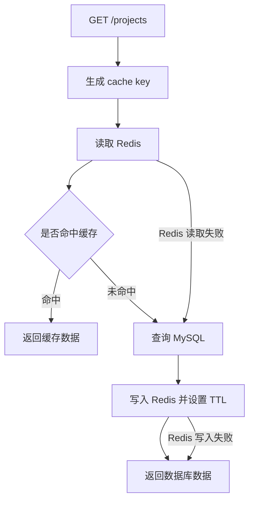

# Redis 缓存阶段复盘

## 1. Redis 在这个项目里解决什么问题

Redis 在这个项目里主要放在 `GET /projects` 前面，用来加速 Project 列表查询。

如果每次列表请求都直接查 MySQL，在数据量变大、请求变多时，数据库压力会更高，响应也可能变慢。Redis 把“常被重复读取的列表结果”临时存起来，下一次相同查询可以优先从 Redis 返回。

需要注意：

```text
Redis 不是主数据源。
MySQL 才是真正保存 Project 数据的地方。
Redis 只是提高读取性能的缓存层。
```

## 2. cache aside 流程是什么

cache aside 可以理解成“业务代码自己在旁边维护缓存”。

这个项目里的流程是：

1. 收到 `GET /projects` 请求。
2. 根据 `userId / page / pageSize / sortBy / sortOrder` 生成 cache key。
3. 先用 cache key 读取 Redis。
4. 如果 Redis 命中，直接返回缓存数据。
5. 如果 Redis 未命中，就调用 `loadProjects` 查询 MySQL。
6. 查询 MySQL 成功后，把结果写回 Redis，并设置 TTL。
7. 最后把 MySQL 查询结果返回给客户端。

这里容易说错的一点是：

```text
不是“写入数据库的数据同步到 Redis”。
```

更准确的说法是：

```text
数据库查出来的列表结果，会被写入 Redis，方便下一次相同列表查询直接命中缓存。
```

## 3. cache key 为什么必须包含 userId / page / pageSize / sortBy / sortOrder

cache key 必须能唯一描述一次查询。

如果少了 `userId`，不同用户可能读到同一个缓存结果，这会造成严重的数据越权问题。

如果少了 `page` 或 `pageSize`，第一页和第二页、每页 10 条和每页 20 条可能会共用同一个缓存，返回的数据数量和位置就会错。

如果少了 `sortBy` 或 `sortOrder`，按创建时间升序和降序查询可能会返回同一份缓存，列表顺序就会错。

所以这里不是简单的“不知道是哪一次查询”，而是：

```text
少字段会让不同查询共享同一个 key，最后返回错误用户、错误页码、错误数量或错误排序的数据。
```

## 4. TTL 是解决什么问题

TTL 是缓存的过期时间。

它解决的是：

```text
就算缓存失效逻辑漏掉了，缓存也不会永久存在。
```

在这个项目里，Project 列表缓存设置了 60 秒 TTL。也就是说，如果没有被主动删除，这份缓存最多也只会保留 60 秒。

TTL 不能完全替代缓存失效。

```text
主动失效：create / update / delete 后马上清理旧缓存，尽量避免返回旧数据。
TTL：作为兜底机制，避免旧缓存长期存在。
```

## 5. 为什么 create / update / delete Project 后要清理列表缓存

这里你原来的理解有一部分偏了。

清理缓存的主要目的不是“避免内存越来越大”，而是：

```text
避免用户看到旧的 Project 列表。
```

举例：

如果 `POST /projects` 创建了一个新 Project，但没有清理列表缓存，那么用户再次请求 `GET /projects` 时，Redis 可能还返回创建之前的旧列表，新 Project 就看不到。

如果 `PATCH /projects/:id` 更新了 Project 名称，但没有清理列表缓存，那么列表里可能还是旧名称。

如果 `DELETE /projects/:id` 删除了 Project，但没有清理列表缓存，那么列表里可能还会出现已经删除的 Project。

所以缓存失效的核心是数据正确性：

```text
写操作会改变列表结果，所以写成功后要清理相关列表缓存。
```

## 6. 为什么 Redis 读取失败可以降级到数据库

Redis 读取失败只代表缓存层不可用，不代表数据本身不可用。

因为 MySQL 才是主数据源，所以 Redis 读取失败时，可以跳过缓存，继续调用 `loadProjects` 查询 MySQL。

这样做的好处是：

```text
性能可能变慢，但接口仍然能返回正确数据。
```

这就是故障降级：

```text
缓存坏了 -> 放弃缓存加速 -> 保留核心业务能力
```

## 7. 为什么 loadProjects 失败不能被吞掉

`loadProjects` 代表真正的数据查询，也就是从 MySQL 获取 Project 列表。

如果 `loadProjects` 失败，说明主数据源查询失败了。这个时候接口已经没有可靠数据可以返回，所以不能吞掉错误，更不能返回：

```json
{
  "success": true
}
```

Redis 失败和 MySQL 失败的区别是：

```text
Redis 失败：缓存加速失败，但仍然可以查 MySQL。
MySQL 失败：主数据源失败，没有可靠数据可以返回。
```

所以：

```text
缓存失败可以降级。
数据库失败必须暴露为错误。
```

## 8. 这一阶段我还没完全理解的点

目前我已经理解：

- Redis 像一个临时的高速读取层。
- MySQL 才是真正的数据来源。
- cache key 必须完整表达一次查询。
- create / update / delete 后清理缓存是为了避免旧数据。
- Redis 失败时可以降级，MySQL 失败不能假装成功。

后面还可以继续理解：

- 真实项目里 Redis 降级失败要不要打日志。
- Redis 错误日志应该怎么控制噪音。
- 多个接口共用缓存时，缓存 key 怎么设计得更系统。
- 什么时候用 Redis 缓存，什么时候不值得加缓存。

## 9. 流程图



## 10. 自测问题

1. 如果 cache key 不包含 userId，会发生什么？

不同用户可能会共用同一个 Project 列表缓存。这样 A 用户可能看到 B 用户的数据，这是严重的权限和数据安全问题。

2. 如果 Redis 挂了，为什么 GET /projects 不应该直接失败？

因为 Redis 只是缓存层，不是主数据源。Redis 挂了以后，接口可以绕过缓存，继续查询 MySQL，只是性能可能变慢。

3. 如果 MySQL 挂了，为什么不能返回 success: true？

因为 MySQL 是主数据源。MySQL 查询失败时，接口没有可靠的 Project 数据可以返回，如果还返回 `success: true`，客户端会误以为这次请求成功了。
