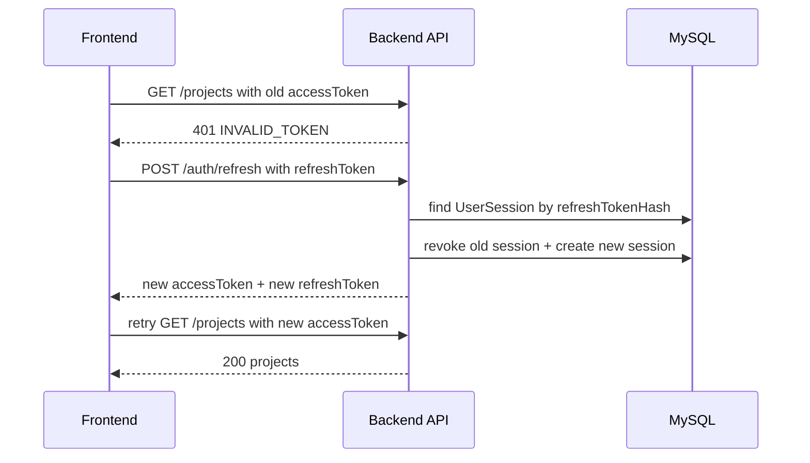

# Task: 前后端鉴权复盘：Refresh Token Rotation 和自动 Refresh

## 背景

你现在已经把完整鉴权链路串起来了：

```text
后端：
POST /auth/login
POST /auth/refresh
refresh token rotation

前端：
保存 accessToken + refreshToken
请求自动带 accessToken
遇到 401 后调用 /auth/refresh
refresh 成功后更新两个 token，并重试原请求一次
```

这张任务不新增功能，主要把整条链路复盘清楚。

---

## 你会练到什么

- 解释 access token / refresh token / session 三者如何协作
- 解释 refresh token rotation 为什么需要前端更新 refreshToken
- 区分 axios interceptor 和手写 `authenticatedFetch`
- 解释为什么自动 refresh 只能重试一次
- 画出一次“业务请求 401 -> refresh -> retry”的完整链路

---

## 任务 1：写一份复盘文档

创建文件：

```text
docs/reviews/auth-refresh-flow.md
```

写入以下结构，并用自己的话补全：

```markdown
# 前后端鉴权 Refresh Flow 复盘

## 登录成功后发生了什么？

...

## 业务 API 请求时发生了什么？

...

## accessToken 过期后发生了什么？

...

## refresh token rotation 为什么要求前端保存新的 refreshToken？

...

## authenticatedFetch 和 axios interceptor 有什么像？

...

## 为什么只能重试一次？

...
```

---

## 任务 2：画出请求链路

在同一个文档里补一段 Mermaid：

````markdown

````

---

## 任务 3：运行验证

跑格式检查：

```bash
npm run format:check
```

如果格式不通过：

```bash
npm run format
npm run format:check
```

---

## 完成标准

- [ ] 新增 `docs/reviews/auth-refresh-flow.md`
- [ ] 能讲清楚 login / request / refresh / retry
- [ ] 能解释为什么 refresh token rotation 后必须保存新的 refreshToken
- [ ] 能解释 `authenticatedFetch` 和 axios interceptor 的关系
- [ ] `npm run format:check` 通过

完成后告诉我：

```text
鉴权 refresh flow 复盘完成了
```
