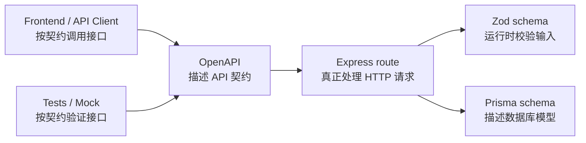

# Task: 后端工程化复盘：OpenAPI 到底解决什么问题

## 背景

你已经手写了一份：

```text
docs/openapi.json
```

现在先不要急着进入“自动生成文档”。

OpenAPI 很容易被学成“又一个配置文件”，但它真正重要的点是：

```text
它把 API 从“只有后端代码知道”变成“前端、后端、测试、工具都能读懂的契约”。
```

这张任务不新增业务代码，主要帮你把 OpenAPI、Express、Zod、Prisma 的边界讲清楚。

---

## 你会练到什么

- 用自己的话解释 OpenAPI 是什么
- 区分 OpenAPI、Express route、Zod schema、Prisma schema
- 理解为什么 API 文档也属于“工程化”
- 理解 OpenAPI 对前端、测试、Mock、类型生成有什么价值
- 为下一步“用 Zod 辅助生成 OpenAPI”做铺垫

---

## 任务 1：创建复盘文档

创建文件：

```text
docs/reviews/openapi-contract.md
```

写入以下结构。

你可以先照着提示写，不要求写得很正式，重点是自己能讲出来：

```markdown
# OpenAPI 契约复盘

## OpenAPI 是什么？

用自己的话解释：

...

## OpenAPI 不是什么？

它不是 Express route，因为：

...

它不是 Zod schema，因为：

...

它不是 Prisma schema，因为：

...

## 它能帮前端做什么？

...

## 它能帮测试做什么？

...

## 当前 docs/openapi.json 描述了哪些接口？

...

## 为什么后面可以用 Zod 辅助生成 OpenAPI？

...
```

---

## 任务 2：参考当前项目写例子

在复盘文档里补一段“项目例子”。

可以参考这个方向写：

```markdown
## 项目里的例子

`POST /auth/login` 在 OpenAPI 里描述了：

- 请求 body 需要 `email` 和 `password`
- 成功后返回 `user`、`accessToken`、`refreshToken`
- 失败时返回统一的 `ErrorResponse`

`GET /projects` 在 OpenAPI 里描述了：

- 这个接口需要 Bearer Token
- 成功后返回当前用户的 project 列表
- 失败时可能返回鉴权错误
```

这里的关键点不是背格式，而是看懂：

```text
OpenAPI 关心的是“调用这个接口的人需要知道什么”。
```

---

## 任务 3：画一张边界图

在同一个文档里补一段 Mermaid。

直接使用下面这段也可以：

````markdown

````

这张图想表达：

```text
Express 是实际执行者。
Zod 是请求进入系统时的校验器。
Prisma 是数据库层的模型和查询工具。
OpenAPI 是给调用者和工具看的 API 说明书。
```

---

## 任务 4：运行验证

跑格式检查：

```bash
npm run format:check
```

如果格式不通过，先跑：

```bash
npm run format
npm run format:check
```

---

## 完成标准

- [ ] 新增 `docs/reviews/openapi-contract.md`
- [ ] 能用自己的话解释 OpenAPI 是 API 契约
- [ ] 能区分 OpenAPI / Express / Zod / Prisma
- [ ] 能说出 OpenAPI 对前端和测试的价值
- [ ] `npm run format:check` 通过

完成后告诉我：

```text
OpenAPI 契约复盘完成了
```
