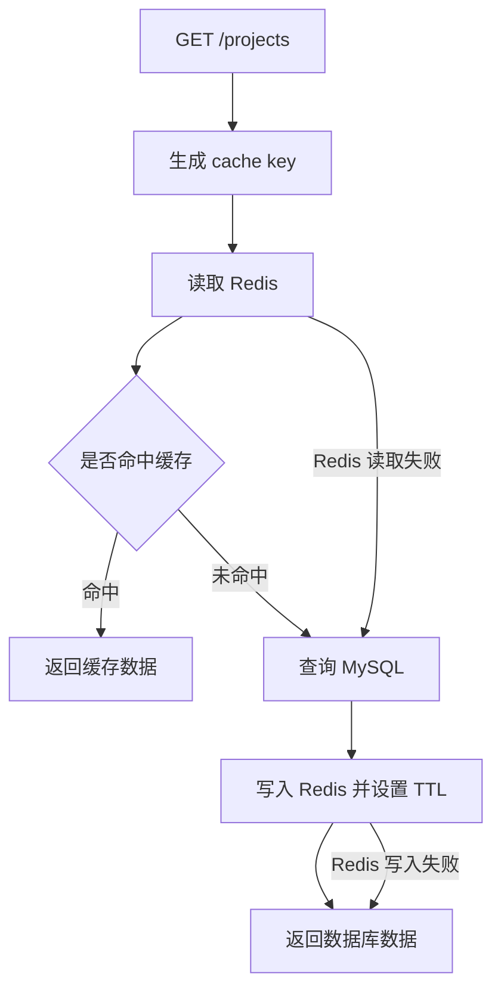

# Task: Redis 缓存阶段复盘：故障降级 / cache aside / 可观察性

## 背景

你已经完成了 Redis 缓存这一小阶段：

```text
Project 列表 cache key
Redis JSON helper
Project 列表缓存读取
Project 列表缓存失效
Project API 接入缓存
Project 更新 / 删除后清理缓存
Redis 失败时降级到数据库
```

现在先不要急着继续写新功能。

缓存这个东西最容易出现一种学习错觉：

```text
代码能跑了，但脑子里还没有形成稳定模型。
```

这张任务就是把模型补上。

---

## 你会练到什么

- 用自己的话解释 cache aside
- 区分主数据源和缓存层
- 理解 key / TTL / invalidation / fallback 之间的关系
- 想清楚什么时候可以吞错误，什么时候必须抛错
- 形成后端工程里“性能优化不能破坏正确性”的直觉

---

## 任务 1：创建复盘文档

新建：

```text
docs/reviews/redis-cache-fallback.md
```

写入下面这些标题。

你先用自己的话写，不需要写得很长。

```md
# Redis 缓存阶段复盘

## 1. Redis 在这个项目里解决什么问题

TODO: 这里写 Redis 为什么被放在 GET /projects 前面。

## 2. cache aside 流程是什么

TODO: 按顺序写出：先读缓存、未命中查数据库、写回缓存、返回结果。

## 3. cache key 为什么必须包含 userId / page / pageSize / sortBy / sortOrder

TODO: 这里写如果少了某个字段，可能会发生什么错。

## 4. TTL 是解决什么问题

TODO: 这里写 TTL 和缓存失效的关系。

## 5. 为什么 create / update / delete Project 后要清理列表缓存

TODO: 这里写如果不清理，会出现什么旧数据。

## 6. 为什么 Redis 读取失败可以降级到数据库

TODO: 这里写 Redis 和 MySQL 的主次关系。

## 7. 为什么 loadProjects 失败不能被吞掉

TODO: 这里写数据库失败和缓存失败的区别。

## 8. 这一阶段我还没完全理解的点

TODO: 这里可以放心写不懂的地方。
```

---

## 任务 2：补一张小流程图

在同一个文件里，加一个 Mermaid 图。

你可以直接使用这个骨架：

````md
## 9. 流程图


````

注意：

```text
Redis 读取失败 -> 查询 MySQL
Redis 写入失败 -> 返回数据库数据
```

这两个箭头就是这张阶段最重要的工程判断。

---

## 任务 3：写 3 个自测问题

在文档最后加：

```md
## 10. 自测问题

1. 如果 cache key 不包含 userId，会发生什么？
2. 如果 Redis 挂了，为什么 GET /projects 不应该直接失败？
3. 如果 MySQL 挂了，为什么不能返回 success: true？
```

每个问题下面用自己的话答 2-4 行。

---

## 任务 4：运行验证

这张任务主要是文档，所以跑：

```bash
npm run format
npm run format:check
```

为了确认刚才 Redis 降级没有被破坏，再跑：

```bash
npm run test -w @learn/api -- tests/integration/project-list-cache.test.ts
```

---

## 完成标准

- [x] 新增 `docs/reviews/redis-cache-fallback.md`
- [x] 解释 Redis 在本项目里解决的问题
- [x] 能用自己的话写出 cache aside 流程
- [x] 能解释 cache key 为什么包含多个查询参数
- [x] 能解释 TTL 的作用
- [x] 能解释 create / update / delete 后为什么要清理缓存
- [x] 能解释 Redis 失败为什么可以降级
- [x] 能解释 MySQL / `loadProjects` 失败为什么不能吞
- [x] 包含 Mermaid 流程图
- [x] 包含 3 个自测问题和答案
- [x] `npm run format:check` 通过
- [x] `npm run test -w @learn/api -- tests/integration/project-list-cache.test.ts` 通过

完成后告诉我：

```text
Redis 缓存阶段复盘完成了
```
