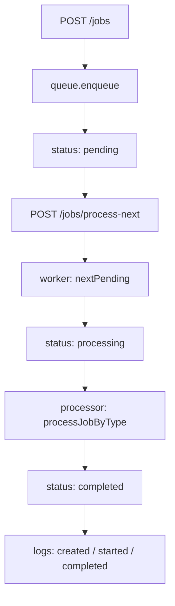

# Task: 后台任务阶段复盘：queue / worker / processor / logs 怎么协作

## 背景

你已经连续完成了一组后台任务练习：

```text
内存队列
worker 处理 pending job
失败重试 attempts / maxAttempts
API 创建任务
API 手动触发 worker
processor 按 type 分发
任务处理 logs
```

这一组内容已经不是简单 CRUD 了，它开始接近真实后端系统里的“异步任务”模块。

这张任务不用写新功能，重点是复盘。你需要用自己的话把流程讲清楚。

---

## 任务 1：新建复盘文件

新建：

```text
docs/reviews/background-job-full-retrospective.md
```

标题：

```md
# 后台任务阶段复盘：queue / worker / processor / logs
```

---

## 任务 2：解释四个角色

请写 4 小节：

```md
## 1. queue 负责什么

## 2. worker 负责什么

## 3. processor 负责什么

## 4. logs 负责什么
```

每一节至少回答：

```text
它保存或处理什么？
它不应该负责什么？
如果这个职责写错位置，会造成什么问题？
```

提示：

```text
queue 偏数据容器
worker 偏状态流转
processor 偏业务处理
logs 偏过程记录
```

---

## 任务 3：画出成功流程

写一个成功流程：

```text
POST /jobs
-> queue.enqueue
-> job.status = pending
-> POST /jobs/process-next
-> worker 取出 pending job
-> job.status = processing
-> processor 按 type 处理
-> job.status = completed
-> logs 记录 created / started / completed
```

你可以用普通文字，也可以用 Mermaid：



---

## 任务 4：画出失败重试流程

写一个失败流程：

```text
processor throw
-> worker catch error
-> addLog("Job processing failed")
-> incrementAttempts
-> 如果 attempts < maxAttempts，status 回到 pending
-> 如果 attempts >= maxAttempts，status 变 failed
```

重点解释：

```text
为什么 processor throw 后 API 仍然可以返回 200？
为什么第一次失败不一定等于最终 failed？
为什么 maxAttempts: 1 的测试可以直接验证 failed？
```

---

## 任务 5：解释为什么测试要注入 queue

请写一节：

```md
## 5. 为什么 jobs API 测试要注入独立 queue
```

至少解释：

```text
全局内存队列为什么会导致测试互相影响？
createJobsTestApp 为什么每次创建新的 queue？
这和真实项目里的数据库测试隔离有什么相似点？
```

---

## 任务 6：写 3 个你现在真正理解的点

最后写：

```md
## 6. 我现在真正理解的 3 个点

1.
2.
3.
```

不用写得漂亮，重点是真实。

---

## 完成标准

- [x] 新建 `docs/reviews/background-job-full-retrospective.md`
- [x] 能解释 queue 的职责
- [x] 能解释 worker 的职责
- [x] 能解释 processor 的职责
- [x] 能解释 logs 的职责
- [x] 写出成功流程
- [x] 写出失败重试流程
- [x] 能解释为什么测试要注入独立 queue
- [x] 写出 3 个自己真正理解的点

完成后告诉我：

```text
后台任务完整复盘完成了
```
