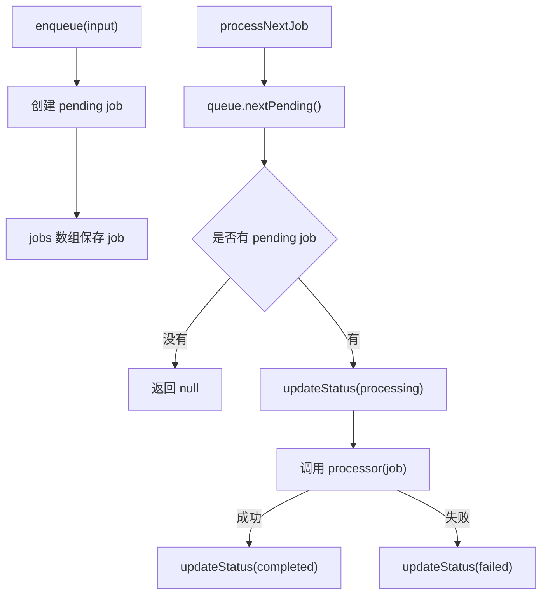

# Task: 后台任务阶段复盘：queue / worker / processor

## 背景

你已经完成了后台任务的最小模型：

```text
Job 类型
Memory Job Queue
processNextJob worker
processor 成功 / 失败测试
```

这张任务不写新代码，先把模型复盘清楚。

后台任务这个概念后面会连接到很多真实工具：

```text
BullMQ
Redis queue
消息队列
邮件发送
异步重试
定时任务
```

但在接这些工具之前，先要分清楚：

```text
queue 负责存任务
worker 负责取任务
processor 负责真正执行任务
```

---

## 任务 1：创建复盘文档

新建：

```text
docs/reviews/background-job-stage.md
```

写入下面结构，并用自己的话补全：

```md
# 后台任务阶段复盘

## 1. 什么是后台任务

TODO: 写出为什么有些事情不适合放在 HTTP 请求里同步处理。

## 2. queue / worker / processor 分别负责什么

TODO: 分别解释 queue、worker、processor。

## 3. Job 为什么需要 status

TODO: 解释 pending / processing / completed / failed 分别表示什么。

## 4. enqueue 做了什么

TODO: 解释 input 和真正保存的 Job 有什么区别。

## 5. nextPending 做了什么

TODO: 解释为什么它只找 pending job。

## 6. processNextJob 的流程是什么

TODO: 按顺序写出：取 pending、改 processing、调用 processor、成功 completed、失败 failed。

## 7. processor 抛错为什么要标记 failed

TODO: 解释为什么不能假装成功。

## 8. 这一阶段我还没完全理解的点

TODO: 写出你还不确定的地方。
```

---

## 任务 2：补流程图

在复盘文档里加：

````md
## 9. 流程图


````

---

## 任务 3：写 3 个自测问题

在文档最后加：

```md
## 10. 自测问题

1. 为什么 `list()` 要返回数组拷贝，而不是直接返回内部 `jobs`？
2. 为什么 `processNextJob` 没有 pending job 时返回 `null`，而不是抛错？
3. 为什么 processor 失败时要把 job 标记为 `failed`？
```

每题用自己的话答 2-4 行。

---

## 任务 4：运行验证

```bash
npm run format
npm run format:check
npm run test -w @learn/api -- tests/unit/memory-job-queue.test.ts tests/unit/job-worker.test.ts
```

---

## 完成标准

- [x] 新增 `docs/reviews/background-job-stage.md`
- [x] 能解释什么是后台任务
- [x] 能解释 queue / worker / processor 的分工
- [x] 能解释 Job status 的意义
- [x] 能解释 enqueue 做了什么
- [x] 能解释 nextPending 为什么只找 pending
- [x] 能解释 processNextJob 的状态流转
- [x] 能解释 processor 失败为什么标记 failed
- [x] 包含 Mermaid 流程图
- [x] 包含 3 个自测问题和答案
- [x] `npm run format:check` 通过
- [x] `npm run test -w @learn/api -- tests/unit/memory-job-queue.test.ts tests/unit/job-worker.test.ts` 通过

完成后告诉我：

```text
后台任务阶段复盘完成了
```
